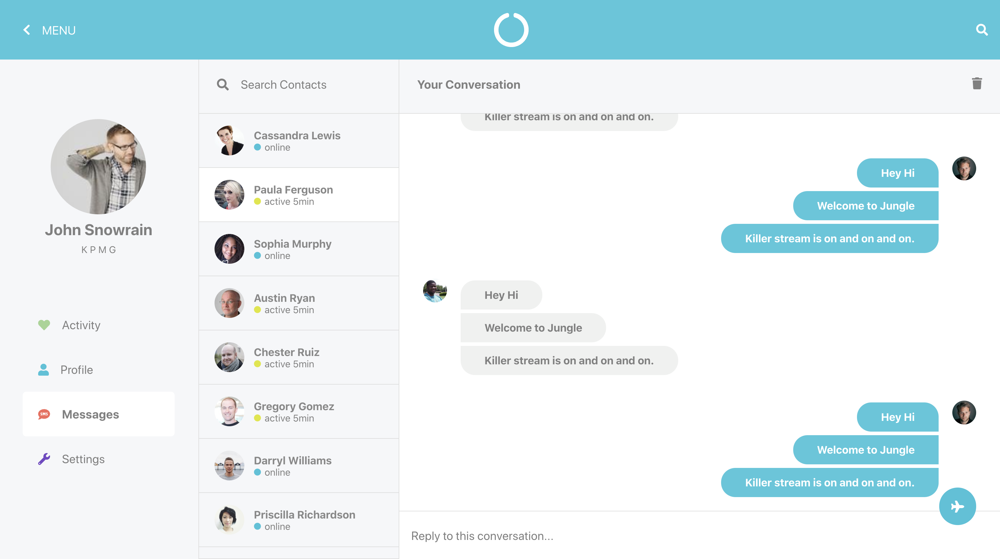

# chat-screen-react
This is chat-box web created in react. The design/UX is from dribble (i lost the url, but i will update it soon once i get it). 

 
You can use this application as a base to practice code anything like socket programming, infinite scroll and infinite reverse scroll.

## Sample View

If you like the design then you can use the components from individual sections as well like Menu, User-List, Conversations etc.

## Installation
This project was a bootstrap on `create-react-app` cli.

### `npm install`
Use the command to install the dependencies.

### `npm start`
This will start on `http://localhost:3000/` 
